# ODOO PDF Form&Report
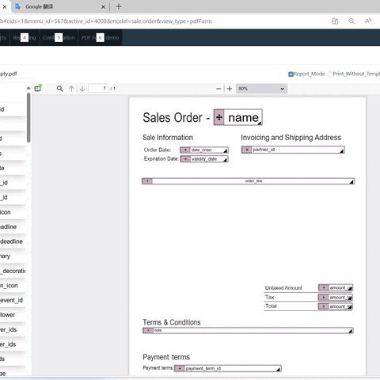
ODOO PDF Form and Report Widget add a new view for model, It defines a model view with PDF as the background, which can be used for WYSIWYG standard form input, various reports with PDF Template, and printed tickets, certificates, invoice etc. without backgroup template,
ODOO PDF表单和报告部件为模型添加了一种新的视图，它定义了一个以 PDF 为背景的模型视图，可用于所见即所得的制式表单输入、带有 PDF 模板的各种报告以及套打票证、发票等。
<br>

- It inherits from form view, support fields of all kind widget same as the field in form view, for it's free positioned on PDF backgroup, so can't using layout tags such as sheet, page, group. 
- 它继承自表单视图，支持与表单视图中相同的字段定义及部件，因为它可以自由定位在 PDF 背景上，因此不能使用 sheet、page、group 等布局标签。
<br>  

- Standard form input, with PDF as the background, accurately locates the input position, flexibly matches font-size, supports almost all widgets, and supports Xxxx2Many, Many2Xxxx type field input defined by tree and form.  
- 以PDF为背景的制式表单输入，精准定位输入位置，灵活自动适配字休大小。支持几乎所有widget，支持关联字段的树和表单定义输入。
<br>

- Existing reports and statements can be used as PDF template backgrounds to generate the required reports and statements, supporting preview and printing. 
- 可以把现有报告及报表做为PDF模板背景，生成所需的报表、报告，支持预览和打印。
<br>
- Through the PDF contract template, you can perform online electronic signatures and electronic contracts.
- 通过PDF合同模板，您可以进行在线电子签名和打印电子合同。
<br>
- By setting print without template, you can print tickets without pdf template
- 通过设置 print without template, 可在套打票证。

## Installation Precautions
- **It using ODOO system pdfjs and viewer,  but now can't patch the viewer.js directly, so you need copy the viewer.js to override the system viewer.js. (the updated viewer.js is in static/lib dir)**
- **When you use contract signature,  it will need the just_digital_sign module, for apps only can release one addon, so if you buy this, You will get an additional sign module for free, please Ask me for it.**
- **The installation package contains demonstrations of four scenarios for reference during use. Because the demonstration needs to rely on HR and Sale modules, and the PDFForm module itself does not depends on other modules, if the demonstration is not needed, you can modify the dependencies in manifest yourself.**

## Demo and Video
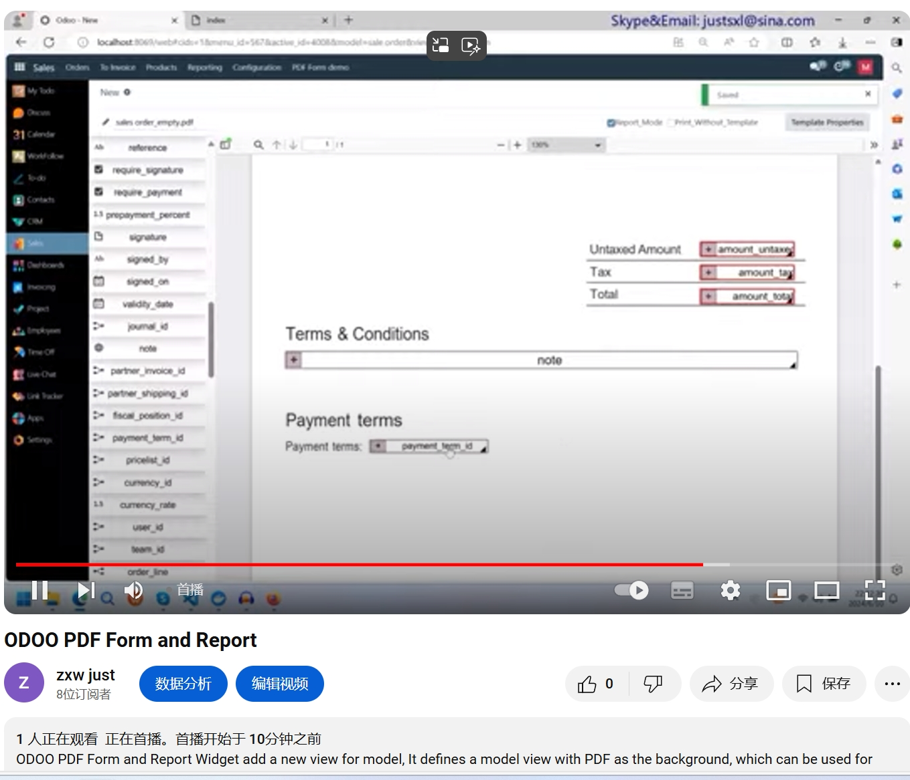
[ODOO PDF Form and Report DEMO Video English](https://youtu.be/yradaN-uoio)

## Application scenarios - PDF Form - HR fill form
- Example of filling out a standard form. Use the standard form as the PDF background. Drag the field to the relevant position and adjust the size. The font size will change accordingly. Click Define Field Properties to specify the widget, Modifies. You can also position and resize it on the template background. The detailed properties can be described in the view definition file.
- 制式表单填写示例，以制式表单为PDF背景，拖拽字段到相关位置，调整大小，字体会跟随变化，点击定义字段属性，可以指定widget, 以及readonly, require, invisible.也可以在模板背景上做定位和大小调整，详细的属性可以在view的定义文件中描述。
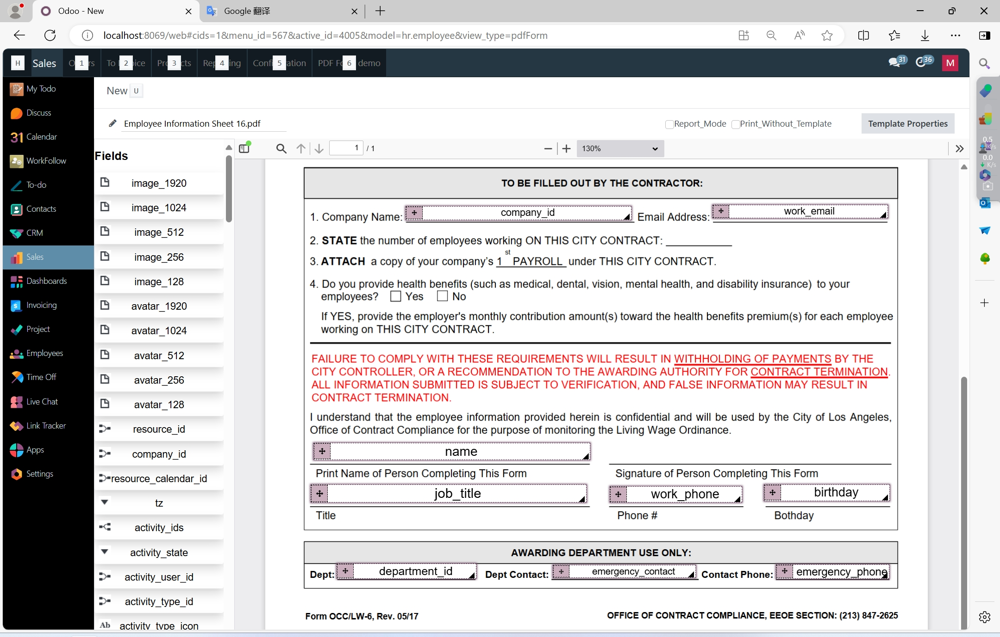

- You can add or modify the view definition in the view editing window or even in the code editor. It is recommended to write additional properties in the code editor. You can also click Template Properties to copy the view definition to the code editor when defining the PDF background, which will facilitate upgrading the view in the future.
- 可以在view的编辑窗口，甚至在代码编辑器中对view的定义进行增改，增改属性等建议在代码编辑器中编写。也可以在pdf背景定义时，点击模板属性 复制view 定义到 代码编辑器中，这样便于以后升级view。
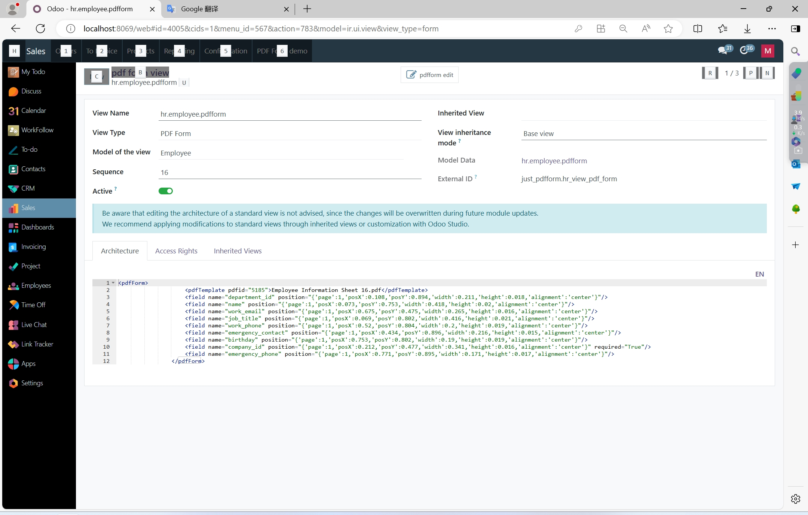
- For List forms, specify pdfForm view to open records, and you can complete record input and modification using PDF templates. If the input form is complex, it is recommended to use form view to make records.
- 对List表单指定按pdfForm view打开记录，就可以完成以PDF制式模板进行记录输入及修改。如果输入表单比较复杂，建议还是使用form view方式进行记录制作。
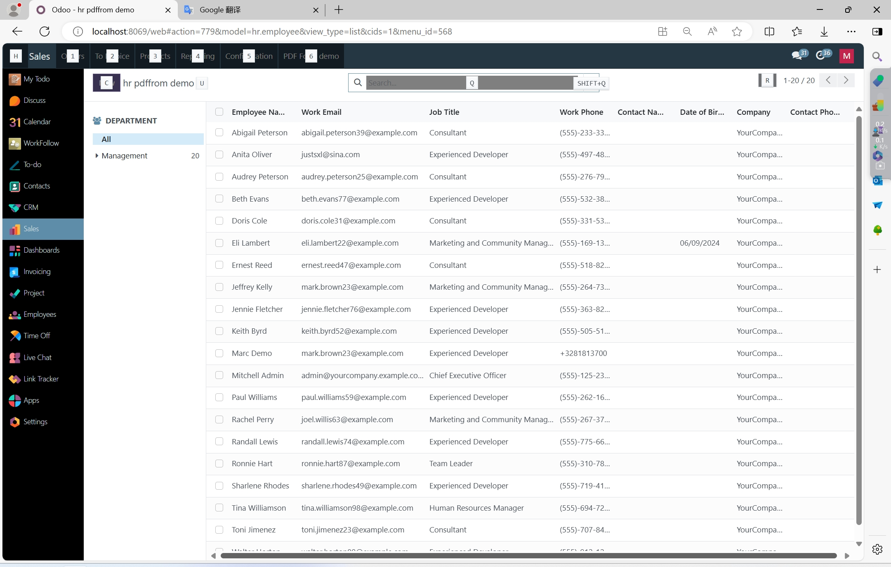
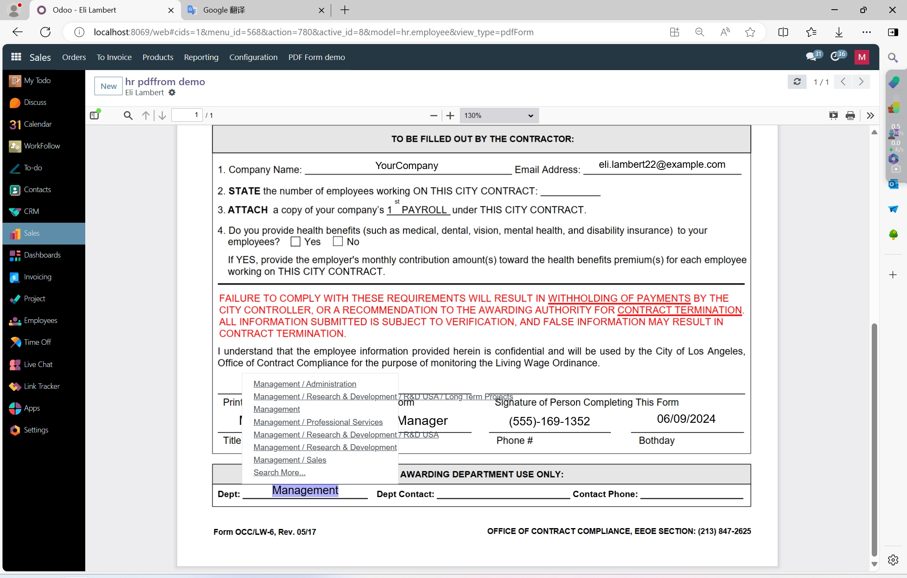

## Application scenarios - PDF Report - Sale order Report
- The PDF report template is derived from the sale order report exported to PDF, and an empty PDF template is formed by deleting the data.
- PDF报表模板来源于sale order report导出成pdf，通过删除数据形成了一个空PDF模板。
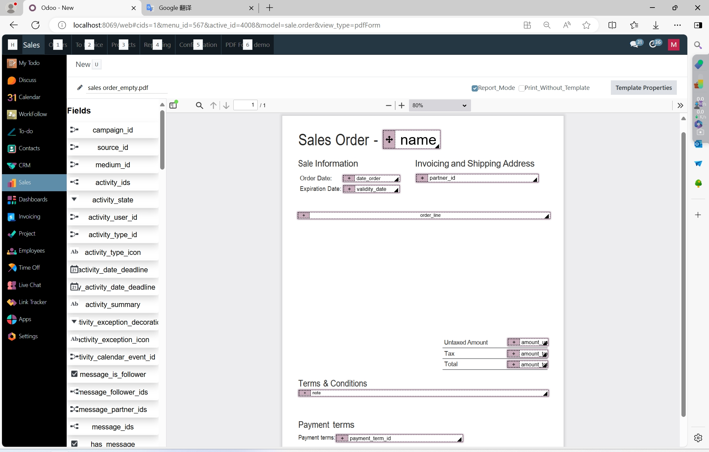
- This is an example of a sales order report. Note that Party A and Party B use the control component, and the order content uses the tree subtable definition.
- 这是一个销售订单报表的案例，注意甲方和乙方使用了 widget="res_partner_many2one" 部件，订单内容使用了tree子表定义。
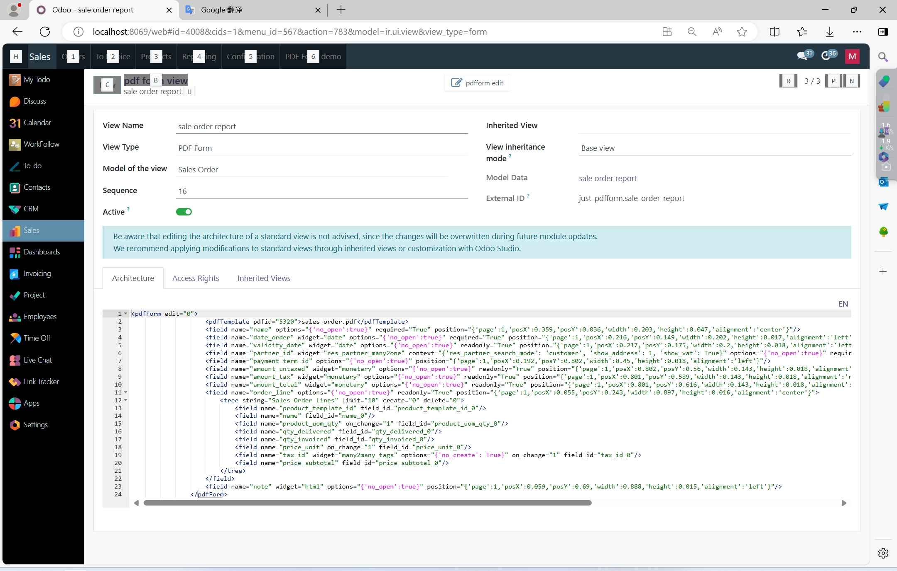
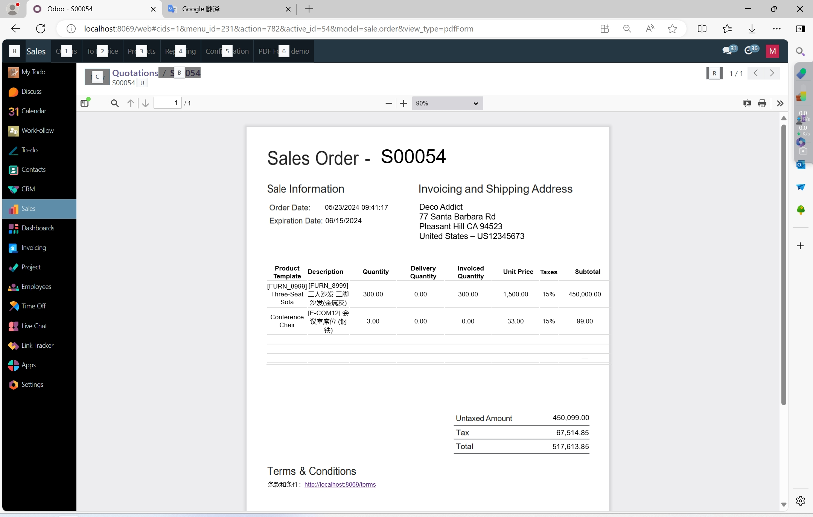
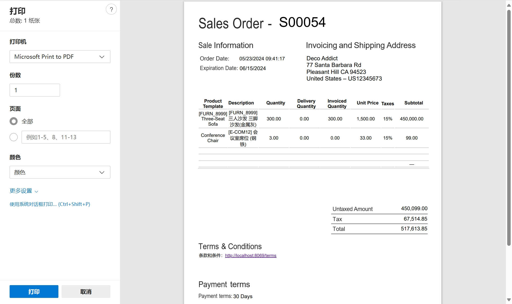

## Application scenarios - PDF Contrct - Sale order Contrct
- The electronic signature and electronic contract mainly use an improved version of the signature component, which can be used in binary image fields and fields that reference users (the contract is a template file that I found by chance, which has nothing to do with the sale order and is only used for demonstration)
- 电子签章和电子合同主要使用了signature部件的改进版本，使它即可以用在binary图象字段，也能用于引用用户的字段（合同是顺手找的一个模板文件，与sale order无关，仅用于演示）

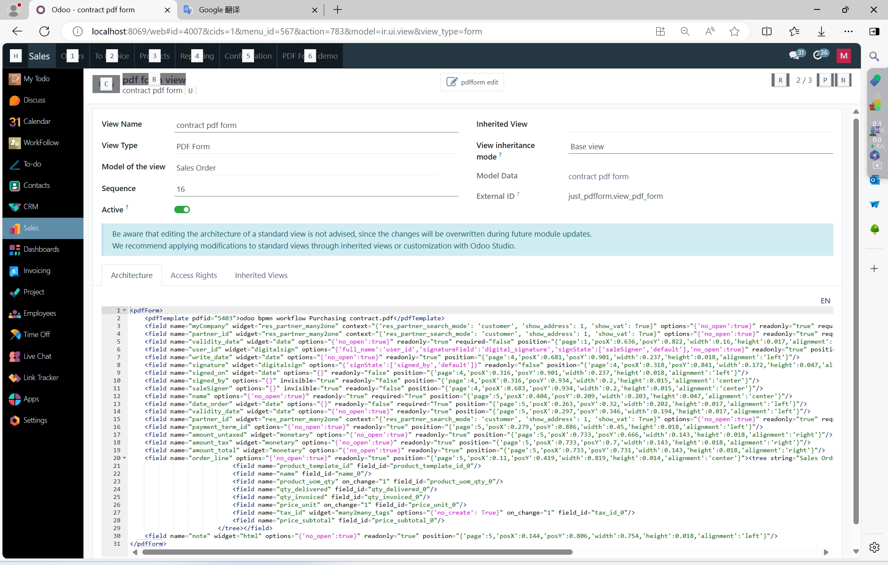
- When signing electronically, the sales manager of the current contract can sign on his own side, the customer representative can sign using his account, or sign the sales order through the portal (the portal method can be used as a reference [sale order online signature](https://www.odoo.com/cs_CZ/slides/slide/online-quotation-612)). In both methods, the signature will be marked in the corresponding position of the contract.
- 电子签章时，当前合同的销售经理可以在乙方签名，客户代表即可以使用它的帐户进行签名，也可以通过门户进行销售订单签名（门户方式可以参考 [在线电子签章](https://www.odoo.com/cs_CZ/slides/slide/online-quotation-612)），两种方式下，签名都会标注在合同相应位置。
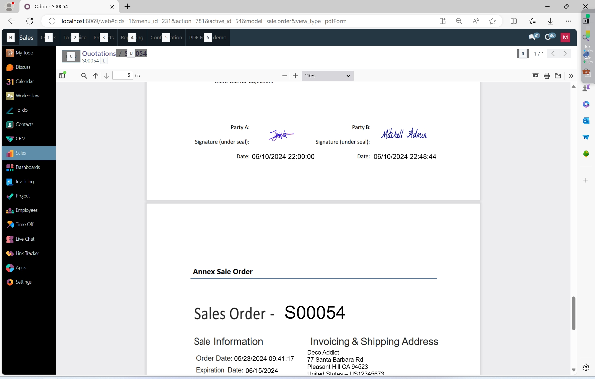

## Application scenarios - PDF Invoice - Print Without Template
- This is an example of invoice duplication. As the template found is not very relevant to the Sale order, only a simple demonstration is given here to illustrate the printing effect after checking "print without template".
- 这是一个发票套打的案例，因找到的模板与Sale order不太相关，这里仅做简单演示，说明 print without template勾选后的打印效果。
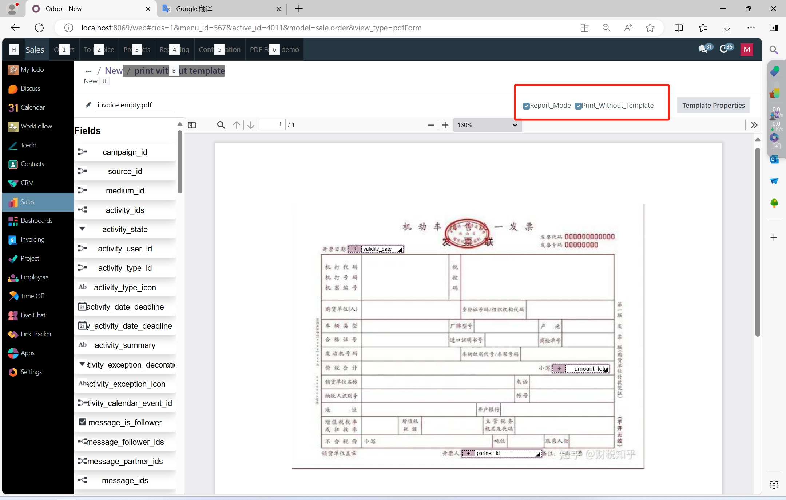
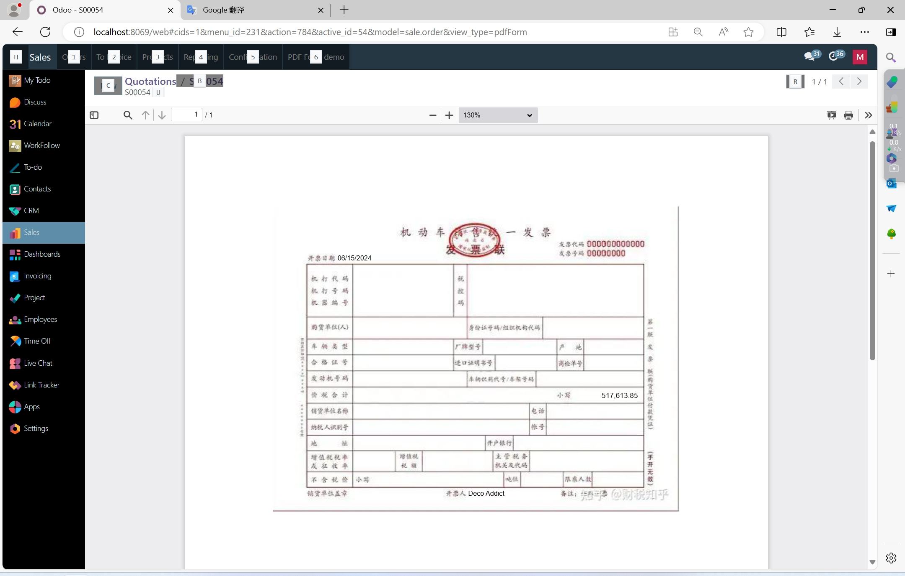
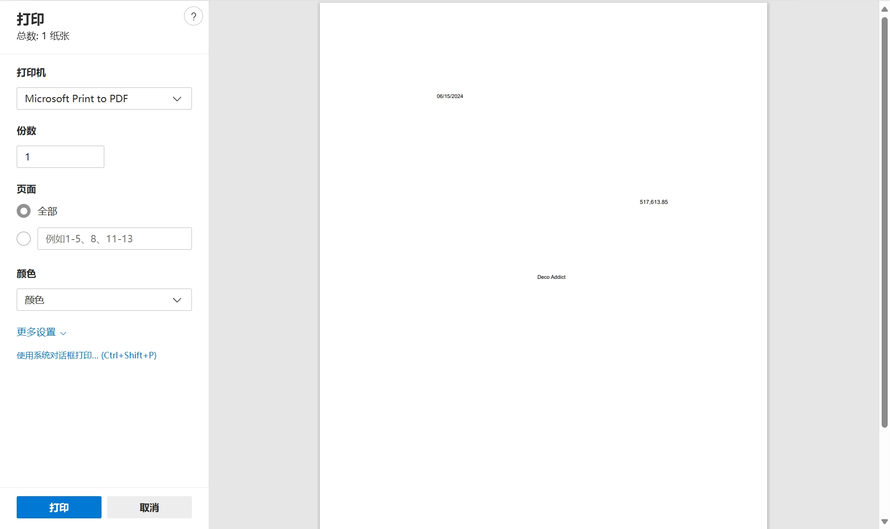

## digitalsign widget

```Xml
# for binary field, comm
<field name="signature" widget="digitalsign" >
```

```xml
# for field relate to res.partner 
#        fullName: field name realte to res.parter,
#        signatureField: res.parner binary field saved signature,
#        signState: if had signed, set the state field,
#        signStateValue:  if had signed, set the state field value,
#        height: the height of the sign widget,
#        width:  the width of the sign widget,

<field name="user_id" widget="digitalsign" readonly="user_id != uid" options="{'full_name':'user_id','signatureField':'digital_signature','signState':['saleSigner','default']}" />
```

## Contact Information 

- Skype: justsxl@sina.com 
- Email: justsxl@sina.com 
- [QQ Immediately QQ立刻联系](tencent://message/?uin=314015700)